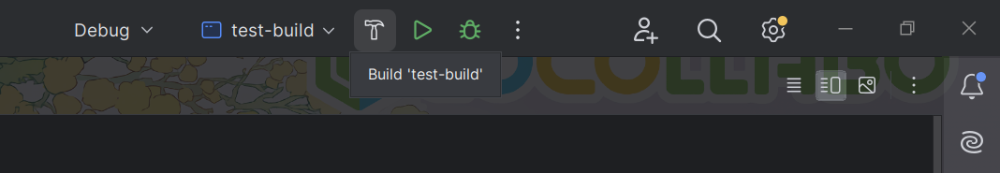
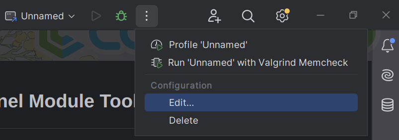
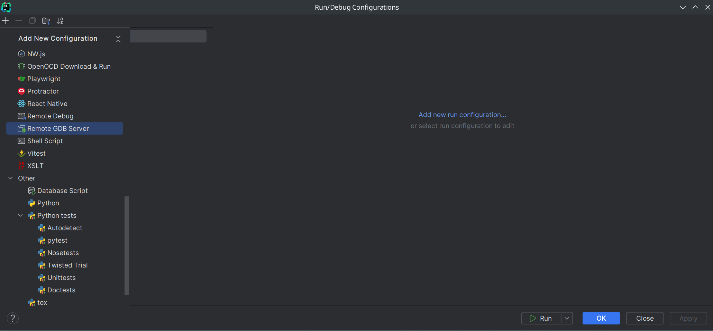
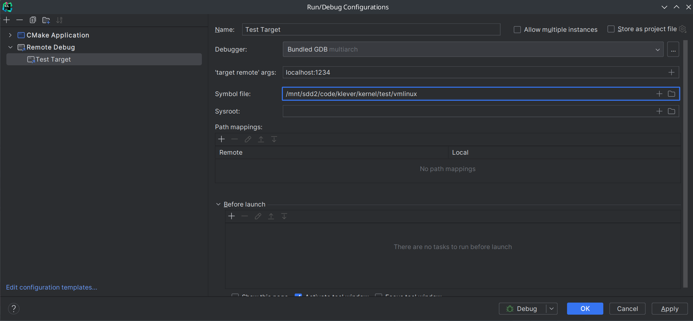
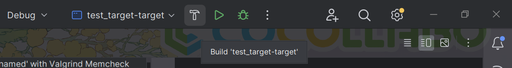
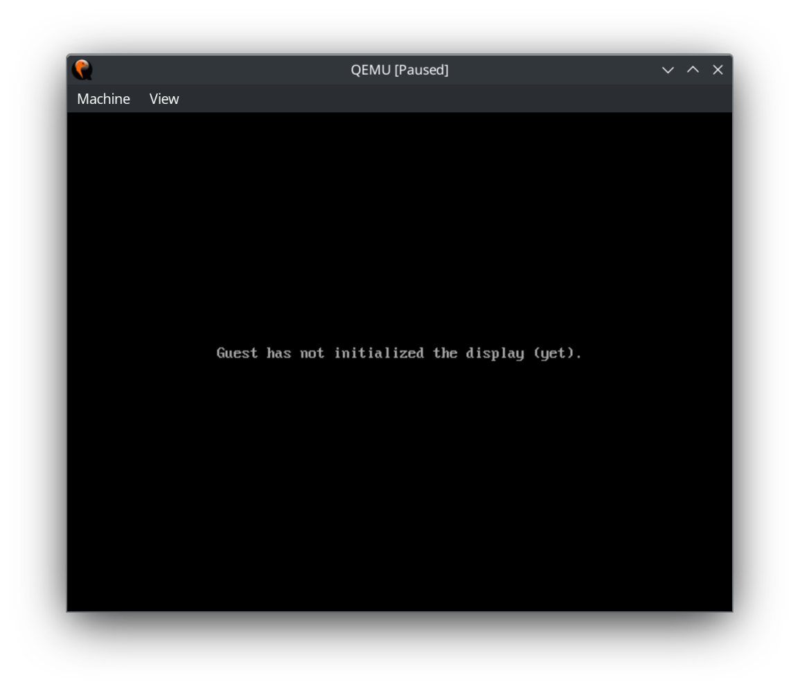
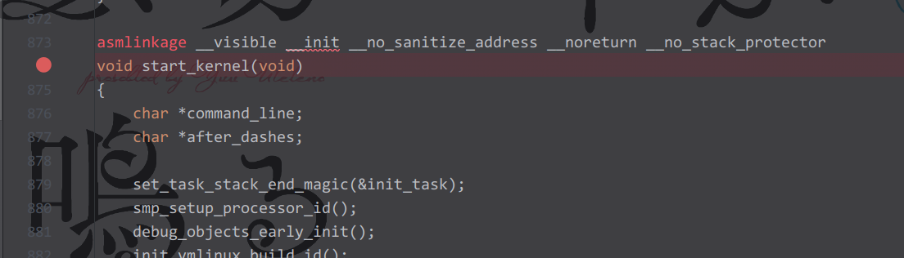
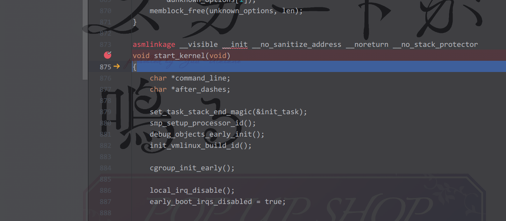
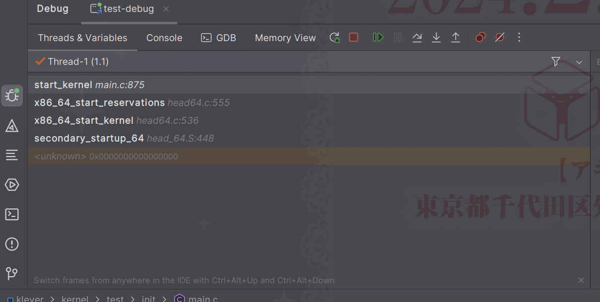

## KLEVER - CMake Linux Kernel / Kernel Module Toolset

---

## Use with CLion

---

- First of all, **build and generate** kernel image (bzImage). Just build (Kernel Name)-build target in CLion.

- When build progress finished, open CLion's Run / Debug Configuration.

- Add **"Remote Debug"** to attach GDB (Debugger) to compiled kernel, which is being run at QEMU.

- Set name, symbol file (vmlinux) 's location and QEMU's local provision port at configuration.
- **Default GDB provision port is "1234".**

- Execute QEMU by **pressing "build" button** for CMake target added with add_kernel_target().

- QEMU window will appear and kernel will wait any GDB connection. 

- Let's Set Breakpoint at start_kernel() function, the entrypoint of the Linux kernel.
- **start_kernel() function is located at (Kernel Path)/init/main.c.**

- Run GDB using setting we have made. This will resume the QEMU machine and invoke breakpoint.
- If kernel stopped execution at the breakpoint we set, You're ready to go!

